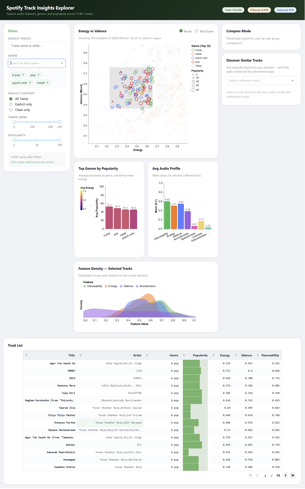

# Spotify Track Insights Explorer

An interactive dashboard for exploring how audio features, genres, and moods relate to track popularity in the Spotify catalogue.

## Deployed App

Public app URL: **https://data-551-group-7-dashboard-milestone-2.onrender.com/**

## DATA 551 – Group 7
- Jingtao Yang  
- Zihao Sheng  
- Richard Hua  
- Yihang Wang  


## Project Overview

In this project, we take the role of a data analytics group within a music-streaming company that supports playlist marketing managers. These users need to understand how different audio and metadata characteristics of tracks relate to popularity in order to design engaging playlists and communicate data-driven insights to artists and labels.

Our goal is to build a dashboard that lets users visually explore how genres and moods relate to track popularity, compare the audio profiles of different regions of the catalogue, and identify tracks that look promising from an audio-feature perspective but are not yet very popular. The final app is intended to support both playful exploration and practical decision-making for playlist strategy and marketing campaigns.


## Data

We use a public Spotify tracks dataset containing 100k+ tracks across many genres, with:

- Track-level identifiers and text fields (ID, name, artists, album)  
- Popularity and duration  
- Categorical descriptors (explicit flag, genre, key, mode, time signature)  
- Continuous Spotify audio features (danceability, energy, valence, tempo, loudness, acousticness, ...)  

We also derive additional variables such as:

- `duration_min` (track length in minutes)  
- `popularity_tier` (low / medium / high)  
- `tempo_band` (slow / medium / fast)  
- `mood_quadrant` based on energy and valence  

**Data source:** [Spotify Tracks Dataset](https://www.kaggle.com/datasets/maharshipandya/-spotify-tracks-dataset) by Maharshi Pandya on Kaggle.


## Running Locally

Prerequisites:
- Python 3.9+
- The dataset at `data/raw/dataset.csv`

Steps:
1. Create/activate a Python environment.
2. Install dependencies: `pip install -r requirements.txt`
3. Run the app: `python src/app.py`
4. Open `http://127.0.0.1:8050/` in your browser.


## App Description & Sketch

The Spotify Track Insights Explorer is designed around multiple coordinated views. On the left, a control panel lets users filter the catalogue by track genre (multi-select), explicit flag, tempo band, and popularity tier. A search box allows quick filtering by track name, artist, or album, which is useful when working with large selections.

The main view is an overview scatterplot of tracks, with energy on the x-axis and valence on the y-axis. Points are coloured by genre and sized by popularity, giving a high-level picture of where different genres and moods sit in audio space. Users can brush over a region of the scatterplot to focus on a particular mood.

When filters or brushing are applied, other panels update to summarize the selected subset. A genre summary view shows bar charts of average popularity and danceability by genre. A feature distribution panel (histograms or density plots) displays how tempo, loudness, and duration are distributed for the current selection. A track list table at the bottom presents the selected tracks with sortable columns (track name, artist, genre, popularity, and key audio features).

Clicking on a specific popular track opens a side panel that highlights audio-similar tracks with lower popularity tiers. This helps playlist editors discover fresh candidates that fit a desired sound while diversifying their playlists. Overall, the app supports a workflow from high-level pattern discovery (which genres dominate a mood region) down to concrete track-level decisions (which songs to add next).

### Dashboard Sketch

View the dashboard sketch here:

[Dashboard sketch PDF](./doc/milestone1/dashboard-sketch.pdf)  

### Dashboard Overview (Milestone 2)



## Run Locally

1. Install dependencies: `pip install -r requirements.txt`
2. Run the app: `python src/app.py`
3. Open: `http://127.0.0.1:8050/`


## Repository Structure

```
DATA-551-GROUP-7/
├── assets/
├── data/
│   ├── processed/
│   └── raw/
│       └── dataset.csv
├── doc/
│   └── reflection-milestone2.md
├── doc/
│   ├── images/
│   └── milestone1/
│       ├── dashboard-sketch.pdf
│       ├── DATA 551-Group-7-Proposal.pdf
│       └── MILESTONE1_CHECKLIST.md
├── reports/
│   └── Milestone 2.ipynb
├── src/
│   ├── __init__.py
│   └── app.py
├── .gitignore
├── CODE_OF_CONDUCT.md
├── CONTRIBUTING.md
├── LICENSE
├── proposal.md
├── README.md
└── team-contract.md
``` 

## For Contributors

If you want to help with development:
- Please read `CONTRIBUTING.md` for workflow and issue/PR guidelines.
- Include clear steps to reproduce bugs and screenshots for UI issues.
- Keep changes scoped and open a PR for review.


## Contributing & Code of Conduct

Please see:

- `CONTRIBUTING.md` for how to report issues and propose changes  
- `CODE_OF_CONDUCT.md` for community expectations and reporting procedures  


## License
This project is licensed under the MIT License.
