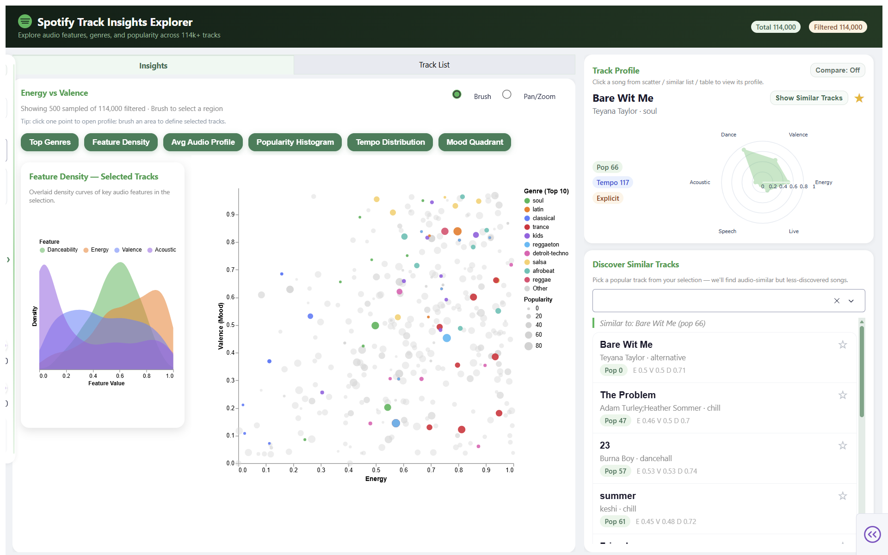

# Spotify Track Insights Explorer

An interactive dashboard for exploring how audio features, genres, and moods relate to track popularity in the Spotify catalogue.

## Deployed App

Public app URL: **https://data-551-group-7-dashboard.onrender.com/**  
(Update this link if your final deployment URL changes.)

## Dashboard Keywords (Plots, Widgets, Interactions)

- Plots: interactive scatterplot, top-genre bar chart, average audio profile bar chart, feature density chart, popularity histogram, tempo distribution histogram, mood heatmap (5x5)
- Widgets: search input, genre dropdown + chips, radio buttons, checklist, range sliders, tab switch, dropdown selector, like/favorite stars
- Interactions: brush selection, click-to-open track profile, similar-track discovery, compare mode, pop-up insight cards, filter drawer toggle, local liked-track persistence

## DATA 551 – Group 7
- Jingtao Yang  
- Zihao Sheng  
- Richard Hua  
- Yihang Wang  


## Project Overview

In this project, we take the role of a data analytics group within a music-streaming company that supports playlist marketing managers. These users need to understand how different audio and metadata characteristics of tracks relate to popularity in order to design engaging playlists and communicate data-driven insights to artists and labels.

Our goal is to build a dashboard that lets users visually explore how genres and moods relate to track popularity, compare the audio profiles of different regions of the catalogue, and identify tracks that look promising from an audio-feature perspective but are not yet very popular. The final app is intended to support both playful exploration and practical decision-making for playlist strategy and marketing campaigns.


## Data

We use a public Spotify tracks dataset containing 100k+ tracks across many genres, with:

- Track-level identifiers and text fields (ID, name, artists, album)  
- Popularity and duration  
- Categorical descriptors (explicit flag, genre, key, mode, time signature)  
- Continuous Spotify audio features (danceability, energy, valence, tempo, loudness, acousticness, ...)  

We also derive additional variables such as:

- `duration_min` (track length in minutes)  
- `popularity_tier` (low / medium / high)  
- `tempo_band` (slow / medium / fast)  
- `mood_quadrant` based on energy and valence  

**Data source:** [Spotify Tracks Dataset](https://www.kaggle.com/datasets/maharshipandya/-spotify-tracks-dataset) by Maharshi Pandya on Kaggle.


## Running Locally

Prerequisites:
- Python 3.9+
- The dataset at `data/raw/dataset.csv`

Steps:
1. Create/activate a Python environment.
2. Install dependencies: `pip install -r requirements.txt`
3. Run the app: `python src/app.py`
4. Open `http://127.0.0.1:8050/` in your browser.


## App Description & Sketch

The Spotify Track Insights Explorer uses coordinated views for drill-down from global pattern discovery to track-level decisions. The center panel focuses on an Energy vs Valence scatterplot (genre-colored, popularity-sized) with brushing for sub-selection. The right panel contains Track Profile and Discover Similar Tracks, supporting click-through exploration and low-popularity recommendation.

The filter panel supports search, genre add/remove chips, explicit/clean toggles, liked-only filtering, tempo and popularity ranges, and a one-click reset. Users can like tracks from the table/profile/similar list and keep those likes in local browser storage.

An insight card system provides focused summaries on demand: Top Genres, Feature Density, Avg Audio Profile, Popularity Histogram, Tempo Distribution, and Mood Heatmap (5x5). This keeps the interface compact while still exposing multiple analytical views when needed.

### Dashboard Sketch

View the dashboard sketch here:

[Dashboard sketch PDF](./doc/milestone1/dashboard-sketch.pdf)  

### Dashboard Overview (Milestone 4)



## Run Locally

1. Install dependencies: `pip install -r requirements.txt`
2. Run the app: `python src/app.py`
3. Open: `http://127.0.0.1:8050/`


## Repository Structure

```text
DATA-551-GROUP-7/
|-- assets/
|-- data/
|   `-- raw/
|       `-- dataset.csv
|-- doc/
|   |-- milestone1/
|   |   |-- dashboard-sketch.pdf
|   |   |-- DATA 551-Group-7-Proposal.pdf
|   |   `-- MILESTONE1_CHECKLIST.md
|   |-- milestone2/
|       |-- Dashboard_Overview.png
|       |-- MILESTONE2_CHECKLIST.md
|       `-- reflection-milestone2.md
|   `-- milestone4/
|       `-- overview.png
|-- reports/
|   `-- Milestone 2.ipynb
|-- src/
|   |-- charts/
|   |   |-- distribution.py
|   |   |-- genre_bar.py
|   |   |-- mood_quadrant.py
|   |   |-- profile.py
|   |   |-- scatter.py
|   |   |-- song_list.py
|   |   `-- tempo_dist.py
|   |-- app.py
|   |-- filter.py
|   `-- __init__.py
|-- .gitignore
|-- CODE_OF_CONDUCT.md
|-- CONTRIBUTING.md
|-- LICENSE
|-- Procfile
|-- proposal.md
|-- README.md
|-- requirements.txt
|-- runtime.txt
`-- team-contract.md
```

## For Contributors

If you want to help with development:
- Please read `CONTRIBUTING.md` for workflow and issue/PR guidelines.
- Include clear steps to reproduce bugs and screenshots for UI issues.
- Keep changes scoped and open a PR for review.


## Contributing & Code of Conduct

Please see:

- `CONTRIBUTING.md` for how to report issues and propose changes  
- `CODE_OF_CONDUCT.md` for community expectations and reporting procedures  


## License
This project is licensed under the MIT License.
